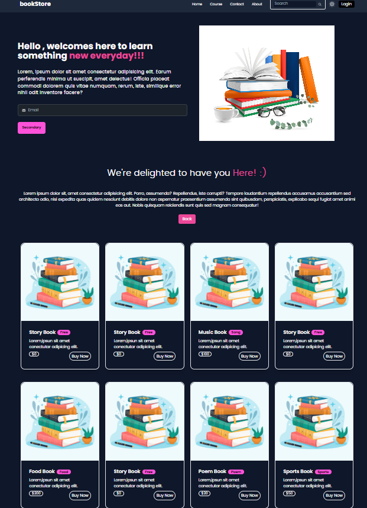
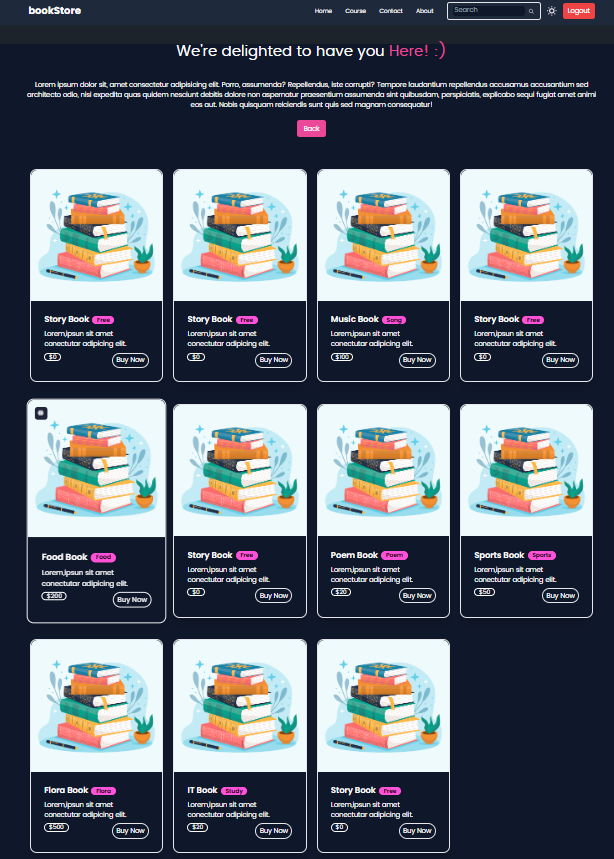
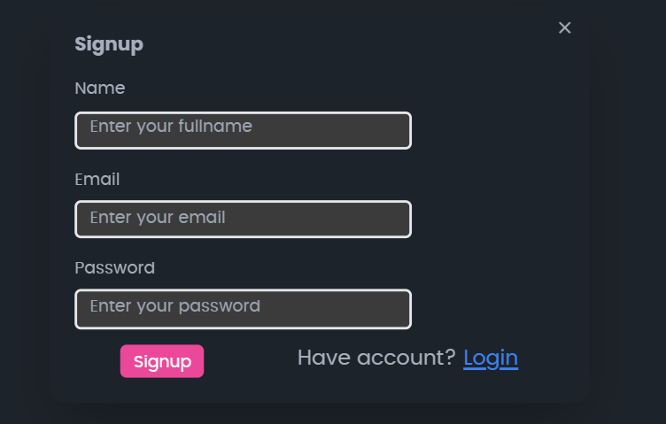

# 📚 Bookstore Web Application (Frontend)

A responsive and interactive bookstore interface built with **React.js**, **Tailwind CSS**, **HTML5**, and **JavaScript**. This project showcases a clean and dynamic frontend for exploring books, offering a smooth user experience and modern design.

---

## 🚀 Features

- 📘 Book browsing interface with clean layout
- 📱 Responsive design for all screen sizes
- ⚡ Fast page updates using React components
- 🎨 Styled using Tailwind CSS utility classes

---

## 📸 Screenshots

| Home Page | Course Page | Signup Page |
|-----------|-------------|-------------|
|  |  |  |

> 📝 Place your screenshots inside a `screenshots/` folder in your project directory.

---
## 🧑‍💻 How to Run Locally

Follow these steps to run the project locally on your machine:
```bash
git clone https://github.com/githubrishi321/bookStoreApp.git
cd bookStoreApp/frontend
npm install
npm run dev
```
Then open your browser and go to: [http://localhost:5173](http://localhost:5173)
> 💡 Make sure you have **Node.js** and **npm** installed on your system before running these commands.


